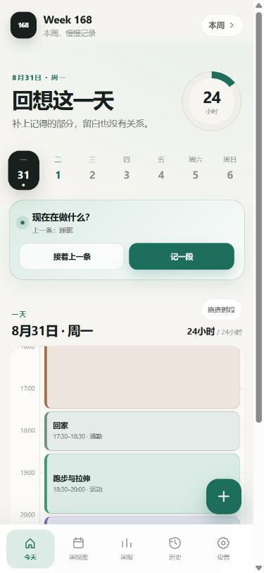
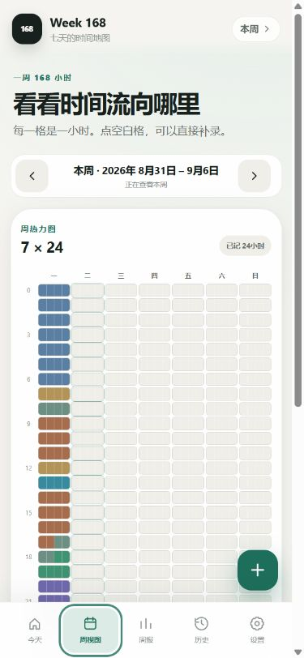
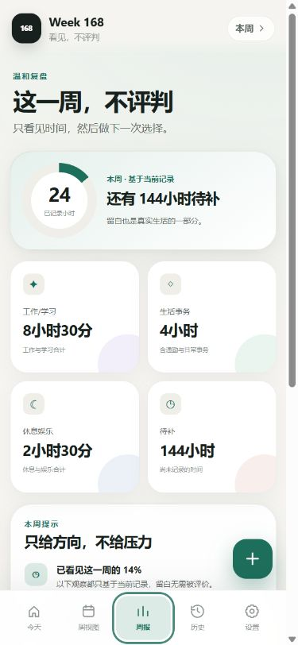

# Week168

把一周的 168 小时看清楚。

本仓库公开的是通用版 Week168：一款简洁的 Android 时间记录工具。它不要求注册账号，不展示广告，不使用分析服务，也不申请网络权限。记录只保存在你的设备上，你可以随时导出 JSON 文件自行备份。

通用版以简体中文为主，支持 Android 8.0（API 26）及以上系统，包名为 `io.github.napoleoncqf.week168`。GitHub Releases 目前提供通用版 v1.0.0。

官网另有个人版「168小时」，包名为 `com.one68hours.app`。两版独立安装，不能互相覆盖升级，记录也不会自动迁移。下方源码说明和预览截图对应通用版 v1.0.0。

## 官网个人版「168小时」下载

| 入口 | 下载 |
| --- | --- |
| 最新版 | **[v1.1.6 下载 APK](https://isotopebase.com/week168/downloads/168-hours-v1.1.6.apk)** |
| 最早版 | [v1.0.2 下载 APK](https://isotopebase.com/week168/downloads/168-hours-v1.0.2.apk) |
| 历史版本 | [查看全部历史版本与说明](https://isotopebase.com/week168/history.html) |
| 官网说明 | [下载说明与校验信息](https://isotopebase.com/week168/#downloads) |

个人版 v1.1.6 更新：简洁首页与待补时间点选；软键盘弹出时仍可使用底部保存按钮，并适配系统主题；默认使用 DeepSeek 快速文字补记；可保存多个 API 配置、测试连接和选择模型；整天空白时分两段预填时间。

## 通用版 Week168 截图

| 日时间轴 | 7 × 24 周视图 | 通用周报 |
| --- | --- | --- |
|  |  |  |

## 通用版功能

- 按 15 分钟粒度记录一天 24 小时，可新建、修改和删除时间段
- 支持快速续接上一条记录，也可直接拖选时间轴
- 一周视图集中查看 168 小时的分配情况
- 周报展示分类占比、记录进度与摘要
- 历史页回看过去的记录
- 内置常用分类，并支持添加自定义分类
- 浅色、深色与跟随系统三种外观模式
- 可选的每日一次本地提醒
- 通过 JSON 文件手动备份与恢复
- 全程离线，无账号、无广告、无网络权限

## 安装

官网个人版「168小时」请从上方入口下载。通用版 Week168 请前往 [GitHub Releases](https://github.com/Napoleoncqf/week168/releases)；目前可下载 v1.0.0 的 `Week168.apk`。

如需校验，可核对对应官网说明页或 GitHub Release 页面提供的 SHA-256。打开 APK 时，Android 可能要求你允许当前浏览器或文件管理器“安装未知应用”；完成安装后，可回到系统设置关闭这项临时授权。“未知来源”提示是因为 APK 通过官网或 GitHub 而不是 Google Play 分发，并不代表应用需要额外权限。请从上方官网或本仓库 Releases 获取对应版本的安装包。

同一应用的兼容更新通常可以直接安装并保留数据；更新包必须与原应用匹配。若 Android 报告签名不一致，请不要先卸载旧版，先在应用的“设置 → 备份与恢复”中导出 JSON 备份。

> **卸载通用版前请先导出 JSON 备份。** 卸载应用或清除应用数据会删除本机记录，而且通用版主动关闭了 Android 系统云备份。没有手动导出的 JSON 文件时，数据无法恢复。

## 通用版权限与隐私

| 项目 | 用途 |
| --- | --- |
| 网络权限 | 不申请。应用不能把记录发送到网络。 |
| 通知权限 | Android 13 及以上系统中，仅在你开启每日提醒时请求；拒绝后其余功能仍可使用。 |
| 开机完成通知 | 用于设备重启、应用更新或时区变化后恢复你已开启的本地提醒。 |
| 文件访问 | 不申请通用存储权限。导入和导出通过 Android 系统文件选择器完成，位置由你决定。 |

应用不包含账号、广告、分析 SDK 或崩溃上报服务。详细说明见 [隐私政策](PRIVACY.md)。

## 从源码构建通用版

构建环境：

- Windows
- PowerShell 7（`pwsh`）
- JDK（建议 JDK 17，并确保 `java`、`javac`、`jar`、`keytool` 可用）
- Android SDK Platform 36
- Android SDK Build Tools 35.0.0

确保已设置 `ANDROID_HOME` 或 `ANDROID_SDK_ROOT`，然后在仓库根目录执行：

```powershell
Copy-Item .\signing.example.psd1 .\android\keystore\signing.local.psd1
```

编辑 `android\keystore\signing.local.psd1`，把示例密码改为足够长的随机密码。该本机配置和密钥目录已被 `.gitignore` 排除，不要提交到仓库。

```powershell
pwsh .\build.ps1 -VersionCode 10000 -VersionName "1.0.0"
```

构建完成后，签名 APK 位于 `release\Week168.apk`。首次构建会生成长期签名密钥；请离线妥善备份密钥、别名和密码。丢失签名密钥后，将无法为已安装用户提供可覆盖安装的更新。

如 Android SDK 不在默认位置，可添加 `-AndroidSdk "D:\path\to\Android\Sdk"`。也可以用 `-SigningConfig` 指定另一个本机签名配置文件。

## 通用版源码测试

项目测试只依赖 Node.js，无需安装第三方 npm 包：

```powershell
node --test tests/core.test.js tests/app-state.test.js tests/ui-layout.test.js
node --check android/app/src/main/assets/core.js
node --check android/app/src/main/assets/app.js
```

GitHub Actions 会运行上述测试和 JavaScript 语法检查，但不会构建或签名 APK。发行 APK 应在受控的本机环境构建，并作为附件上传到 GitHub Releases。

## 目录

```text
Week168/
├─ android/app/src/main/assets/   # 离线界面与核心逻辑
├─ android/app/src/main/java/     # Android 原生外壳和提醒
├─ android/app/src/main/res/      # Android 资源与安全配置
├─ android/tests/                 # APK 验证脚本
├─ tests/                         # Node.js 回归测试
├─ docs/images/                   # 使用虚构数据的公开截图
├─ build.ps1                      # 本机构建、签名与验证
├─ install.ps1                    # 构建并安装到连接的设备
└─ signing.example.psd1           # 签名配置示例
```

源码仓库不跟踪 APK、AAB、签名密钥或本机签名配置。通用版安装包通过 GitHub Releases 分发；官网个人版安装包见上方下载入口。

## 通用版已知限制

- 目前只有 Android 版本，界面以简体中文为主。
- 没有账号、云同步或多设备自动同步；换机需要手动导出并导入 JSON。
- 时间记录以 15 分钟为最小粒度。
- 每日提醒由 Android 本地调度，部分厂商的省电策略可能导致提醒延迟。
- GitHub 通用版不会自动更新，需要手动下载安装新版 APK。
- 卸载或清除应用数据会移除本机记录，除非此前已导出 JSON 备份。

## 参与贡献

欢迎报告问题、改进文档或提交代码。开始前请阅读 [贡献指南](CONTRIBUTING.md)。请勿在 Issue 中公开包含个人时间记录的备份文件。

## License

Week168 使用 [MIT License](LICENSE) 开源。Copyright (c) 2026 Napoleoncqf。
